# 🚗 EV-ADAS-STM32

## STM32-Based Electric Vehicle Advanced Driver Assistance System


> A real-time embedded Electric Vehicle Advanced Driver Assistance System (EV-ADAS) developed using STM32F103C8T6, Embedded C, HC-SR04 ultrasonic sensors, ADC, UART, GPIO, and timer peripherals.

---

# 📌 Overview

**EV-ADAS-STM32** is an embedded Electric Vehicle Advanced Driver Assistance System developed using the **STM32F103C8T6 Blue Pill** microcontroller.

The project combines an **Electric Vehicle control and simulation model** with basic **Advanced Driver Assistance System (ADAS)** functionality.

The system continuously monitors vehicle parameters such as:

- Vehicle speed
- Accelerator input
- Brake input
- Battery State of Charge (SOC)
- Motor temperature
- Motor torque
- Regenerative braking
- Power consumption
- Estimated driving range
- Vehicle state

At the same time, three **HC-SR04 ultrasonic sensors** are used to monitor the environment around the vehicle.

The ADAS subsystem processes the sensor information to implement:

- Forward Collision Warning (FCW)
- Time-to-Collision (TTC)
- Blind Spot Detection (BSD)
- Overspeed Detection
- Obstacle Detection
- Safety warning indication

A dedicated fault-management module handles critical vehicle conditions such as:

- Motor over-temperature
- Low battery SOC
- Collision-related conditions

The project also includes a **UART command shell** that allows vehicle parameters to be monitored and modified during testing.

---

# 🎯 Project Objectives

The main objectives of this project are:

1. Develop an STM32-based EV monitoring and control system.
2. Implement a software model for vehicle speed and EV parameters.
3. Monitor accelerator and brake inputs.
4. Monitor battery State of Charge.
5. Monitor motor temperature.
6. Implement motor torque and regenerative braking calculations.
7. Estimate power consumption and driving range.
8. Interface multiple HC-SR04 ultrasonic sensors.
9. Implement Forward Collision Warning.
10. Calculate Time-to-Collision.
11. Implement Blind Spot Detection.
12. Implement overspeed detection.
13. Implement vehicle fault detection.
14. Provide a UART-based testing and debugging interface.
15. Demonstrate integration of ADC, UART, GPIO, and timer peripherals using STM32.

---

# ✨ Key Features

## 🚘 Electric Vehicle Features

- Real-time vehicle speed calculation
- Accelerator pedal monitoring
- Brake pedal monitoring
- Motor torque calculation
- Motor temperature monitoring
- Battery SOC monitoring
- Regenerative braking model
- Power estimation
- Driving range estimation
- Vehicle state management
- Configurable vehicle speed limit

## 🛡️ ADAS Features

- Forward Collision Warning
- Time-to-Collision calculation
- Critical collision detection
- Left Blind Spot Detection
- Right Blind Spot Detection
- Overspeed detection
- Ultrasonic obstacle detection
- Configurable warning thresholds
- Warning hysteresis

## 📡 Sensor Features

- Three HC-SR04 ultrasonic sensors
- Front obstacle detection
- Left-side obstacle detection
- Right-side obstacle detection
- Echo pulse timing
- Distance calculation
- Sensor validity checking
- TIM2-based microsecond timing

## ⚠️ Safety Features

- Motor over-temperature fault
- Low battery SOC fault
- Collision-related fault
- Fault state handling
- Fault clearing
- Safety indication

## 🔌 Communication Features

- UART debugging
- UART command shell
- Vehicle parameter injection
- Speed injection
- SOC injection
- Temperature injection
- Fault injection
- System status monitoring

---

# 🧰 Hardware Requirements

| Component | Quantity | Purpose |
|---|---:|---|
| STM32F103C8T6 Blue Pill | 1 | Main microcontroller |
| HC-SR04 Ultrasonic Sensor | 3 | Obstacle and blind-spot detection |
| Potentiometer / Analog Input | As required | Vehicle input simulation |
| LEDs | As required | Warning and status indication |
| ST-Link Programmer | 1 | Programming and debugging |
| USB-to-UART Interface | 1 | Serial communication |
| Breadboard | 1 | Prototype implementation |
| Jumper Wires | As required | Circuit connections |
| Power Supply | 1 | System power |

---

# 💻 Software Requirements

- STM32CubeIDE
- STM32 HAL Library
- Embedded C
- STM32CubeMX configuration
- UART terminal software
- Git / GitHub for version control

---

# 🧠 System Architecture

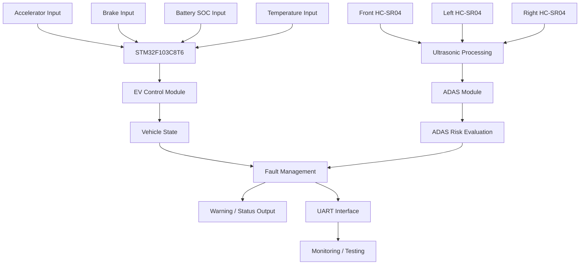

---

# 🔄 Overall Data Flow

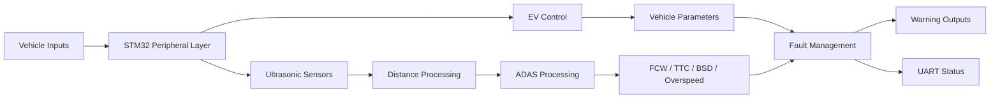

---

# 📡 Ultrasonic Sensor Configuration

Three **HC-SR04 ultrasonic sensors** are used for environmental sensing.

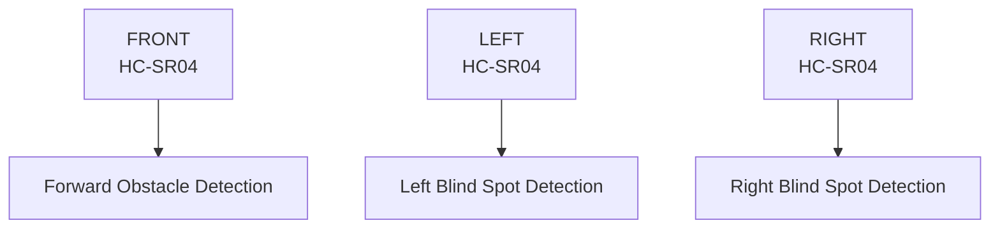

### Sensor Functions

| Sensor | Position | Function |
|---|---|---|
| HC-SR04 | Front | Forward obstacle detection / FCW |
| HC-SR04 | Left | Left blind-spot detection |
| HC-SR04 | Right | Right blind-spot detection |

---

# 📏 Ultrasonic Distance Measurement

The HC-SR04 determines distance by transmitting an ultrasonic pulse and measuring the time taken for the echo to return.

The basic relationship is:

```text
Distance = Echo Time × Speed of Sound / 2
```

The factor of `2` is required because the ultrasonic signal travels from the sensor to the object and back to the sensor.

The project uses **TIM2** as a microsecond timing reference for measuring the echo pulse.

### Sensor Parameters

| Parameter | Configuration |
|---|---:|
| Minimum Detection Distance | 2 cm |
| Maximum Detection Distance | 400 cm |
| Echo Timeout | 30 ms |
| Trigger Pulse | 10 µs |
| Sound Speed Constant | 0.0343 cm/µs |

---

# 🚨 Forward Collision Warning

The Forward Collision Warning system uses the **front HC-SR04 sensor** to detect obstacles ahead of the vehicle.

The system evaluates:

- Front obstacle distance
- Vehicle speed
- Time-to-Collision

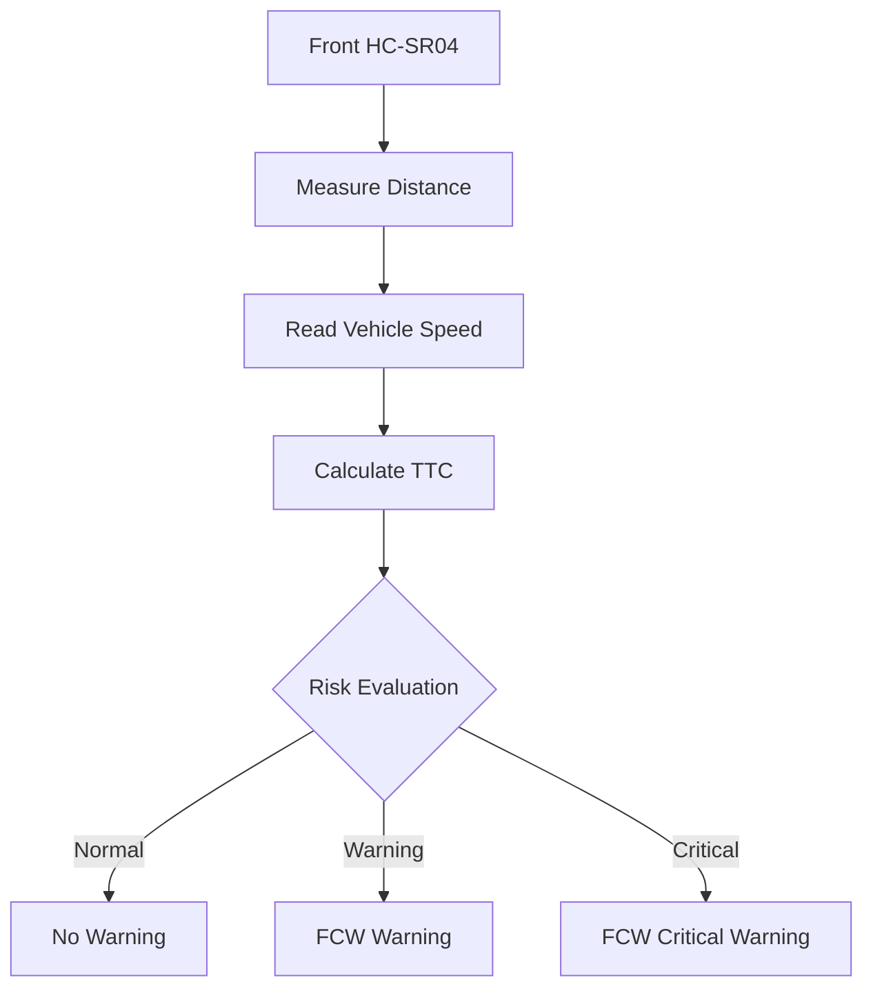

### FCW Thresholds

| Parameter | Value |
|---|---:|
| Warning Distance | 50 cm |
| Critical Distance | 20 cm |

---

# ⏱️ Time-to-Collision

The system calculates **Time-to-Collision (TTC)** using the detected front obstacle distance and vehicle speed.

The basic relationship is:

```text
TTC = Distance / Relative Speed
```

Vehicle speed is converted from km/h to m/s:

```text
Speed (m/s) = Speed (km/h) / 3.6
```

TTC is then used by the ADAS module to determine collision risk.

### TTC Thresholds

| Risk Level | TTC |
|---|---:|
| Warning | 3.0 seconds |
| Critical | 1.5 seconds |

A lower TTC indicates a shorter time before a potential collision.

---

# 👁️ Blind Spot Detection

The system uses the **left and right HC-SR04 sensors** to monitor the vehicle's blind spots.

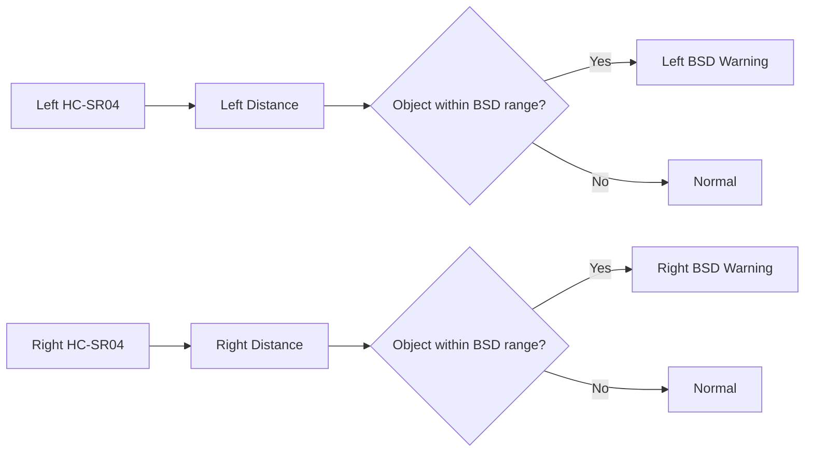

BSD detection is based on:

```text
Object within configured BSD distance
+
Vehicle speed above BSD speed threshold
```

### BSD Configuration

| Parameter | Value |
|---|---:|
| BSD Detection Distance | 30 cm |
| BSD Speed Threshold | 20 km/h |

---

# 🚦 Overspeed Detection

The system continuously monitors vehicle speed.

When:

```text
Vehicle Speed > 120 km/h
```

the overspeed condition is activated.

### Configuration

| Parameter | Value |
|---|---:|
| Overspeed Threshold | 120 km/h |

---

# 🚘 EV Control Model

The EV control module models important electric-vehicle parameters.

The main parameters maintained by the EV control system are:

```text
Accelerator Pedal
Brake Pedal
Vehicle Speed
Motor Torque
Motor Temperature
Battery SOC
Regeneration Level
Power
Estimated Range
Drive Mode
Vehicle State
```

---

# ⚡ Vehicle Speed Model

The vehicle speed is updated periodically based on accelerator and brake inputs.

The system considers:

- Accelerator input
- Brake input
- Vehicle speed
- Vehicle drag/deceleration

The maximum configured vehicle speed is:

```text
200 km/h
```

---

# ⚙️ Motor Torque

The EV model calculates motor torque based on the vehicle operating condition and accelerator input.

### Maximum Motor Torque

```text
150 Nm
```

---

# ♻️ Regenerative Braking

The EV model includes regenerative braking functionality.

Regenerative braking is considered during braking conditions and contributes to the vehicle's simulated energy recovery.

### Maximum Regenerative Torque

```text
80 Nm
```

---

# 🔋 Battery State of Charge

The system maintains battery **State of Charge (SOC)** as a percentage.

```text
0%   → Empty
100% → Full
```

SOC is used as part of the EV state and fault-management system.

The system also includes a configurable low-SOC fault threshold.

---

# 🌡️ Motor Temperature

Motor temperature is continuously monitored.

### Maximum Configured Motor Temperature

```text
90°C
```

If the motor temperature exceeds the configured safety condition, the fault-management module can activate an over-temperature fault.

---

# ⚡ Power and Range Estimation

The EV control module maintains estimates for:

- Power consumption
- Battery energy usage
- Estimated driving range

These values are available as part of the vehicle state and can be monitored through the UART interface.

---

# ⚠️ Fault Management

A dedicated fault-management module monitors critical vehicle conditions.

### Fault Types

| Fault | Description |
|---|---|
| OT | Motor over-temperature |
| SOC | Low battery SOC |
| COL | Collision-related condition |

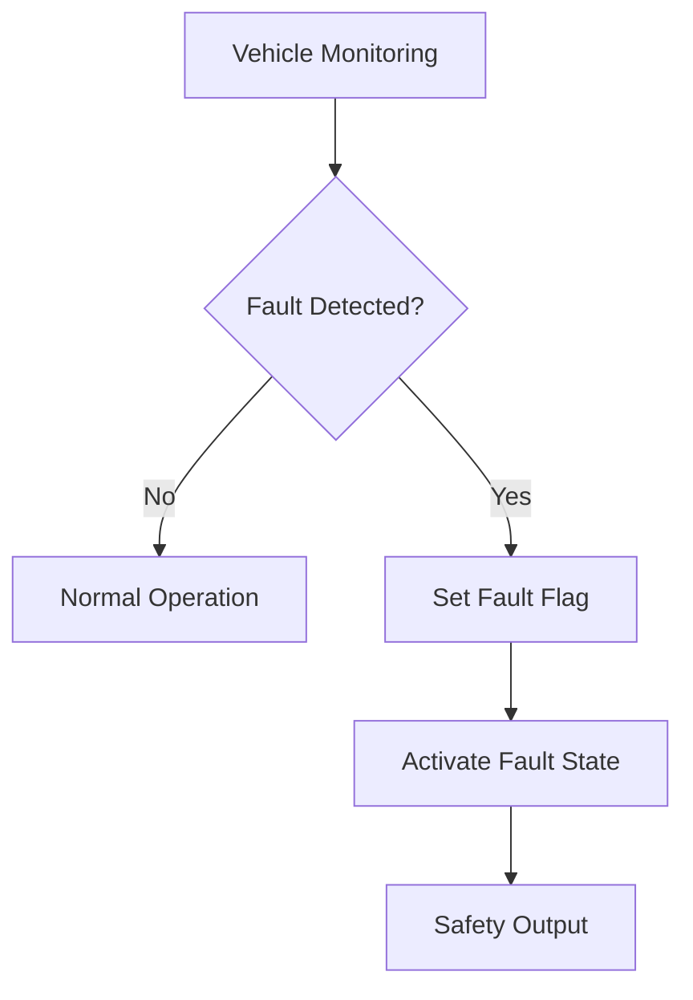

---

# 🔌 UART Command Interface

The project includes a UART shell for testing and debugging.

The UART interface can be used to:

- Monitor vehicle status
- Inject vehicle speed
- Set battery SOC
- Set motor temperature
- Change operating mode
- Inject faults
- Clear faults

---

# 💬 UART Commands

### Speed

```text
speed set <kmh>
```

Example:

```text
speed set 50
```

This sets the simulated vehicle speed to 50 km/h.

---

### Battery SOC

```text
soc set <percentage>
```

Example:

```text
soc set 80
```

---

### Motor Temperature

```text
temp set <temperature>
```

Example:

```text
temp set 70
```

---

### System Status

```text
status
```

The status output can provide information such as:

- Vehicle speed
- Battery SOC
- Motor temperature
- Motor torque
- Power
- Range
- ADAS status
- Fault status
- Vehicle state

---

# ⏱️ Timer Configuration

The project uses three timers for different purposes.

| Timer | Function | Approx. Period |
|---|---|---:|
| TIM1 | EV control update | 10 ms |
| TIM2 | Ultrasonic microsecond timing | Microsecond counter |
| TIM3 | ADAS / sensor update | 100 ms |

---

## TIM1 — EV Control

TIM1 is used for periodic EV control processing.

```text
10 ms
≈ 100 Hz
```

The EV state is updated periodically using this timing reference.

---

## TIM2 — Ultrasonic Timing

TIM2 provides the microsecond timing required for HC-SR04 echo measurement.

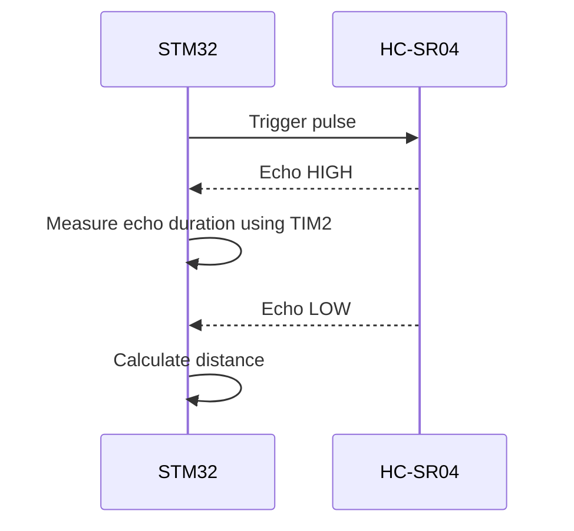

---

## TIM3 — ADAS/Sensor Processing

TIM3 provides a periodic trigger for sensor and ADAS processing.

Current processing interval:

```text
100 ms
≈ 10 Hz
```

---

# 🎛️ ADC Inputs

The EV system uses ADC inputs for vehicle parameter acquisition.

| ADC Channel | Input |
|---|---|
| ADC Channel 0 | Accelerator |
| ADC Channel 1 | Brake |
| ADC Channel 2 | Battery SOC |
| ADC Channel 3 | Temperature |

The ADC values are processed and converted into the corresponding vehicle parameters.

---

# 💡 Warning Outputs

GPIO outputs are used for warning and status indication.

The system can indicate:

- Forward Collision Warning
- Blind Spot Detection
- Overspeed
- Fault status
- Vehicle status

---

# 📊 Current System Parameters

| Parameter | Current Value |
|---|---:|
| Maximum Vehicle Speed | 200 km/h |
| Maximum Motor Torque | 150 Nm |
| Maximum Regen Torque | 80 Nm |
| Maximum Motor Temperature | 90°C |
| FCW Warning Distance | 50 cm |
| FCW Critical Distance | 20 cm |
| TTC Warning | 3.0 s |
| TTC Critical | 1.5 s |
| BSD Detection Distance | 30 cm |
| BSD Speed Threshold | 20 km/h |
| Overspeed Threshold | 120 km/h |

> These are prototype/software configuration values and can be modified for testing.

---

# 🧩 Software Architecture

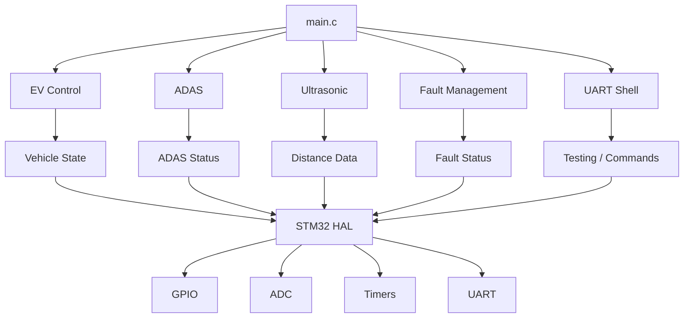

---

# 📁 Project Structure

```text
EV-ADAS-STM32/
│
├── Core/
│   │
│   ├── Inc/
│   │   ├── adas.h
│   │   ├── common.h
│   │   ├── ev_control.h
│   │   ├── fault.h
│   │   ├── main.h
│   │   ├── stm32f1xx_hal_conf.h
│   │   ├── stm32f1xx_it.h
│   │   ├── uart_shell.h
│   │   └── ultrasonic.h
│   │
│   └── Src/
│       ├── adas.c
│       ├── ev_control.c
│       ├── fault.c
│       ├── main.c
│       ├── stm32f1xx_hal_msp.c
│       ├── stm32f1xx_it.c
│       ├── syscalls.c
│       ├── sysmem.c
│       ├── system_stm32f1xx.c
│       ├── uart_shell.c
│       └── ultrasonic.c
│
├── Drivers/
│
├── Startup/
│
├── .cproject
├── .gitignore
├── .mxproject
├── .project
├── EV Dash.ioc
├── STM32F103C8TX_FLASH.ld
└── README.md
```

---

# 🧩 Source Code Modules

## `main.c`

The main application file is responsible for:

- HAL initialization
- System clock configuration
- GPIO initialization
- ADC initialization
- UART initialization
- Timer initialization
- EV update scheduling
- ADAS update scheduling
- Sensor processing
- Main application loop

---

## `ev_control.c`

Responsible for the EV model:

- EV initialization
- Accelerator processing
- Brake processing
- Vehicle speed
- Motor torque
- Motor temperature
- Battery SOC
- Regenerative braking
- Power calculation
- Range estimation
- Vehicle state
- Test parameter injection

---

## `adas.c`

Responsible for ADAS functionality:

- Front obstacle processing
- TTC calculation
- Forward Collision Warning
- Blind Spot Detection
- Overspeed detection
- Warning levels
- ADAS output control

---

## `ultrasonic.c`

Responsible for:

- HC-SR04 triggering
- Echo timing
- Distance calculation
- Front sensor reading
- Left sensor reading
- Right sensor reading
- Sensor validity

---

## `fault.c`

Responsible for:

- Fault detection
- Fault flags
- Fault state
- Safety output
- Fault clearing

---

## `uart_shell.c`

Responsible for:

- UART command processing
- Speed injection
- SOC injection
- Temperature injection
- Mode selection
- Fault injection
- Fault clearing
- Status monitoring

---

# 🧪 Testing and Validation

The system can be tested under different EV and ADAS operating conditions.

---

## Test 1 — Vehicle at Standstill

### Input

```text
Accelerator = 0%
Brake = 0%
```

### Expected Result

```text
Vehicle speed ≈ 0 km/h
```

---

## Test 2 — Acceleration

### Input

```text
Accelerator > 0%
Brake = 0%
```

### Expected Result

```text
Vehicle speed increases
```

Increasing accelerator input results in a stronger acceleration response.

---

## Test 3 — Braking

### Input

```text
Brake > 0%
```

### Expected Result

```text
Vehicle speed decreases
```

---

## Test 4 — Forward Obstacle


---

## Test 5 — Blind Spot

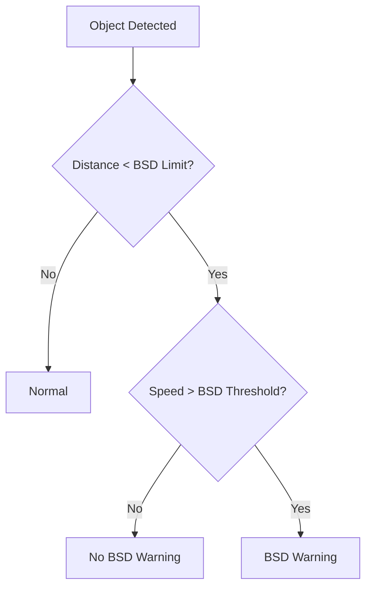

---

## Test 6 — Overspeed

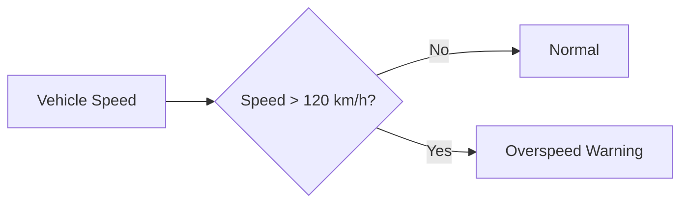

---

## Test 7 — Motor Over-Temperature

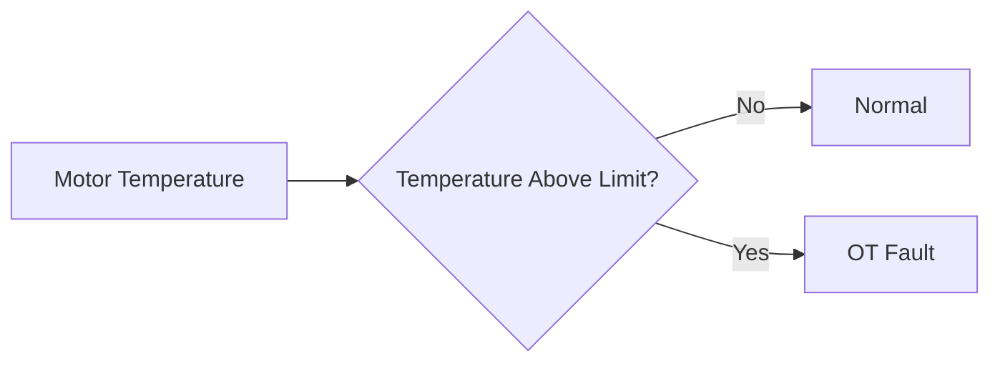

---

## Test 8 — Low Battery SOC

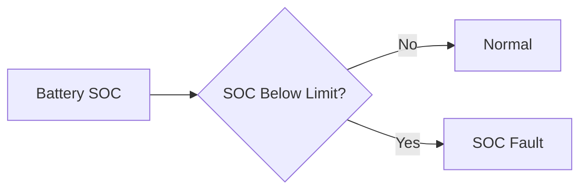

---

# 🚀 How to Build and Run

## Requirements

### Hardware

- STM32F103C8T6 Blue Pill
- ST-Link programmer/debugger
- Three HC-SR04 ultrasonic sensors
- Analog input sources/potentiometers
- LEDs
- UART interface
- Suitable power supply

### Software

- STM32CubeIDE
- STM32 HAL
- USB/UART terminal software

---

# 1️⃣ Clone the Repository

```bash
git clone https://github.com/utkarshchaudhary252/EV-ADAS-STM32.git
```

---

# 2️⃣ Open the Project

Open **STM32CubeIDE** and import the cloned project.

The project contains:

```text
.project
.cproject
.mxproject
EV Dash.ioc
```

---

# 3️⃣ Configure / Inspect the Project

Open:

```text
EV Dash.ioc
```

Verify the required:

- GPIO
- ADC
- UART
- TIM1
- TIM2
- TIM3

configurations.

---

# 4️⃣ Build the Project

In STM32CubeIDE:

```text
Project → Build Project
```

or use:

```text
Ctrl + B
```

---

# 5️⃣ Connect the Hardware

Connect the STM32 board with:

```text
STM32F103C8T6
      │
      ├── ST-Link
      ├── Front HC-SR04
      ├── Left HC-SR04
      ├── Right HC-SR04
      ├── Analog Inputs
      ├── LEDs
      └── UART
```

---

# 6️⃣ Flash the Firmware

Use ST-Link and STM32CubeIDE to program the firmware into the STM32F103C8T6.

---

# 7️⃣ Monitor the System

Open a UART terminal and monitor the vehicle parameters and ADAS status.

Use the available UART commands for testing.

---

# 📷 Project Documentation

A `Documentation` folder can be added to the repository to store project images and diagrams.

Recommended structure:

```text
Documentation/
│
├── hardware_setup.jpg
├── stm32_bluepill.jpg
├── ultrasonic_setup.jpg
├── circuit_diagram.png
├── system_architecture.png
├── uart_output.png
├── stm32cubeide.png
└── demo.jpg
```

---

# 🖼️ Adding Images to README

Once the images are uploaded to the `Documentation` folder, they can be displayed using:

```markdown
## 📷 Hardware Setup


## 📷 Ultrasonic Sensors


## 📷 UART Output


```

---

# 🎥 Project Demonstration

Add your project demonstration video here.

```markdown
## 🎥 Demonstration

[▶️ Watch EV-ADAS-STM32 Demonstration](YOUR_VIDEO_LINK)
```

You can replace `YOUR_VIDEO_LINK` with your YouTube or other video URL.

---

# 🔮 Future Improvements

The current implementation provides a foundation for further EV and ADAS development.

## 🤖 AI-Based Object Detection

Future versions can integrate cameras and AI/ML models for:

- Vehicle detection
- Pedestrian detection
- Object classification
- Traffic-sign recognition

---

## 🚗 Automatic Emergency Braking

The collision-risk information can be extended to implement automatic braking during critical conditions.

---

## 📡 CAN Bus Integration

Automotive CAN communication can be added for communication with:

- Motor controller
- Battery Management System
- Vehicle ECU
- Other automotive control units

---

## 📷 Camera-Based ADAS

Future camera-based functions can include:

- Lane detection
- Lane departure warning
- Vehicle detection
- Pedestrian detection
- Traffic-sign recognition

---

## 📱 Real-Time Dashboard

A PC or web-based dashboard can display:

- Vehicle speed
- Battery SOC
- Motor temperature
- Motor torque
- Power
- Range
- Front distance
- Left distance
- Right distance
- TTC
- FCW status
- BSD status
- Overspeed status
- Fault status

---

## 🔗 Sensor Fusion

Future versions can combine ultrasonic sensors with additional sensors such as:

- Camera
- IMU
- LiDAR
- Wheel encoders

to improve environmental perception and system reliability.

---

# 🎯 Applications

This project can be used as a prototype platform for:

- Electric Vehicle systems
- Automotive embedded systems
- ADAS research
- STM32-based vehicle controllers
- Ultrasonic obstacle detection
- Embedded C learning
- Real-time embedded systems
- Automotive electronics
- EV control research
- Sensor interfacing
- Microcontroller-based safety systems

---

# 📚 Educational Concepts Demonstrated

This project demonstrates practical implementation of:

- STM32 microcontroller programming
- Embedded C
- ADC interfacing
- GPIO control
- UART communication
- Timer configuration
- Interrupt-based processing
- Ultrasonic sensor interfacing
- Distance measurement
- Vehicle-state simulation
- EV control concepts
- ADAS algorithms
- Time-to-Collision calculation
- Fault management
- Real-time embedded processing

---

# ⚠️ Limitations

This project is an **embedded prototype and educational implementation**.

It is not intended to be directly deployed in a production vehicle or used as a safety-certified automotive system.

The current implementation primarily uses:

- Ultrasonic sensors for environmental perception
- Software-modeled vehicle parameters
- STM32-based embedded processing

A production automotive implementation would require additional engineering, including:

- Automotive-grade sensors
- Automotive-grade controllers
- Redundant sensing
- Robust communication systems
- Real-vehicle validation
- Extensive safety testing
- Functional-safety engineering
- Automotive standards compliance
- Hardware and software qualification

---

# 📊 Project Highlights

| Category | Implementation |
|---|---|
| Microcontroller | STM32F103C8T6 |
| Programming Language | Embedded C |
| Development Environment | STM32CubeIDE |
| Sensor Technology | HC-SR04 Ultrasonic |
| Number of Ultrasonic Sensors | 3 |
| Vehicle Model | Embedded EV Simulation |
| ADAS | FCW, TTC, BSD, Overspeed |
| Communication | UART |
| Analog Interface | ADC |
| Timing | TIM1, TIM2, TIM3 |
| Safety | Fault Management |
| Debugging | UART / ST-Link |

---

# 🌟 Key Achievements

- Integrated multiple STM32 peripherals into a single embedded application.
- Implemented a software-based EV control model.
- Implemented real-time vehicle parameter monitoring.
- Integrated three ultrasonic sensors.
- Implemented Forward Collision Warning.
- Implemented Time-to-Collision calculation.
- Implemented Blind Spot Detection.
- Implemented overspeed monitoring.
- Implemented fault-management logic.
- Developed a UART command interface for testing.
- Created a modular embedded software architecture.

---

# 👨‍💻 Author

## Utkarsh Chaudhary

**Electronics & Telecommunication Engineering**

### GitHub

[@utkarshchaudhary252](https://github.com/utkarshchaudhary252)

---

# 📜 License

This project is intended primarily for **educational, academic, and research purposes**.

Refer to the repository license for applicable terms of use and distribution.

---

# ⭐ Support

If you find this project useful for learning about:

- STM32
- Embedded C
- Electric Vehicles
- ADAS
- Ultrasonic Sensors
- Automotive Electronics

consider giving the repository a ⭐ on GitHub.

---

# 🚗 EV-ADAS-STM32

### Embedded EV Control + Ultrasonic Perception + ADAS Safety Logic

**Built with STM32F103C8T6 • Embedded C • STM32CubeIDE • HC-SR04**
